<div align="center">

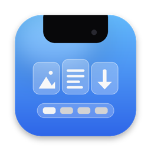

# UltraNotch

**El notch de tu Mac, convertido en isla dinámica.**<br>
Música con letra en vivo, agenda, estante de archivos, portapapeles con ranuras,<br>
tus sesiones de Claude Code desde el notch… y **Dottie**, que vive ahí arriba.


[Qué hace](#qué-hace) · [Instalación](#instalación) · [Claude Code](#claude-code-desde-el-notch) · [Privacidad](#privacidad) · [Desinstalar](#desinstalar)

<br>

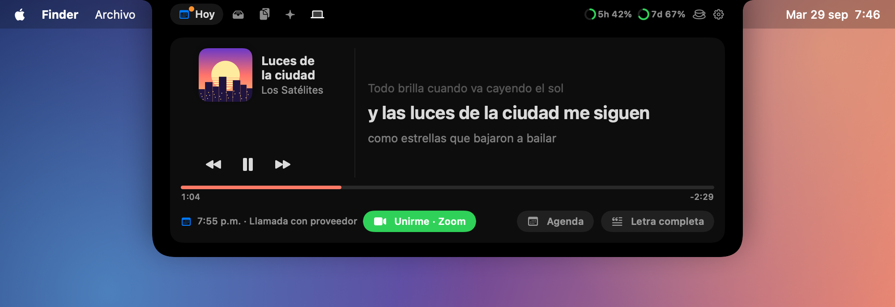

<sub>*A native macOS app that turns your MacBook's notch into a dynamic island — music with live lyrics, calendar, file shelf, clipboard slots, live Claude Code sessions and approvals, voice commands, and a tiny mascot named Dottie. Docs and UI in Spanish.*</sub>

</div>

---

## De un vistazo

<table>
  <tr>
    <td width="50%" align="center">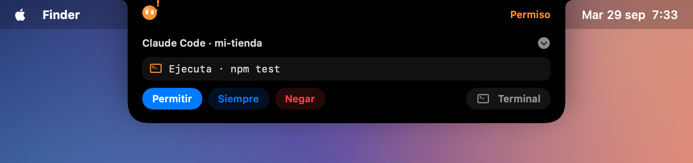<br><b>Aprueba a Claude Code sin ir a la terminal</b></td>
    <td width="50%" align="center">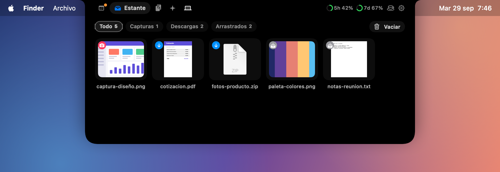<br><b>Un estante para tus capturas y descargas</b></td>
  </tr>
  <tr>
    <td align="center">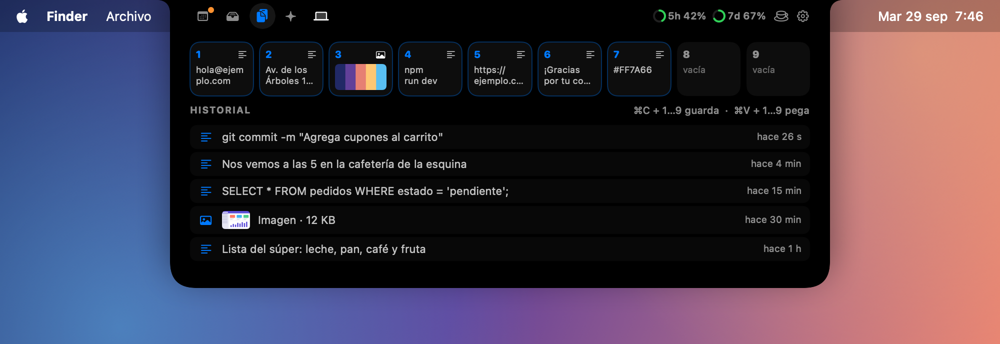<br><b>9 ranuras: ⌘C / ⌘V + número</b></td>
    <td align="center">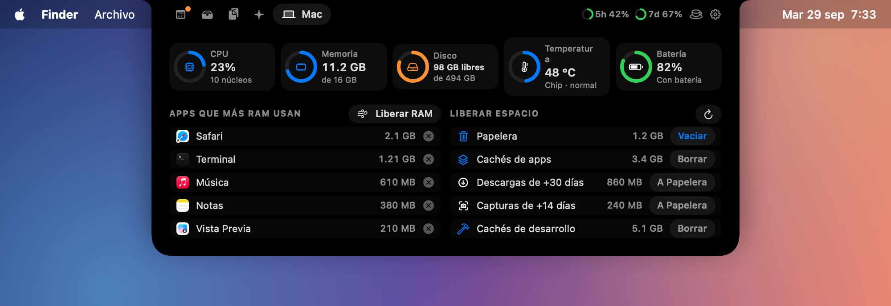<br><b>CPU, RAM, disco y limpieza</b></td>
  </tr>
</table>

- **Nativa y ligera** (SwiftUI + AppKit). Sin cuentas, sin suscripciones, sin API de pago.
- **Casi todo pasa en tu Mac.** Lo poco que sale a internet está en [Privacidad](#privacidad).
- **Hecha en español**: interfaz, voz y código.

## Instalación

```bash
git clone https://github.com/terder95/UltraNotch.git
cd UltraNotch
./instalar.sh
```

Compila, arma `UltraNotch.app`, la copia a **Aplicaciones** y la abre. Solo necesitas **macOS 13 o superior** y las herramientas gratuitas de Apple (`xcode-select --install`). Pasa el mouse por el notch y listo.

Para actualizar: `git pull && ./instalar.sh`. Más detalles en [Requisitos](#requisitos) y [Permisos](#permisos-que-pide).

---

## Qué hace

### 🎵 Hoy: música, letra y agenda

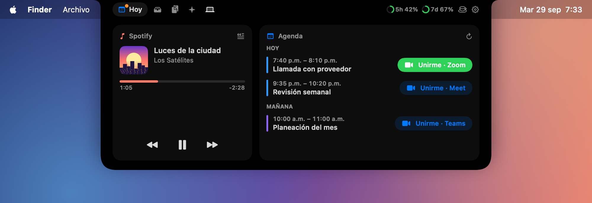

- **Lo que suena** en Spotify o Música, con carátula, avance y controles. Al cambiar de canción sale un aviso cortito junto al notch.
- **Letra en vivo**: la línea que se canta en grande, con la anterior y la siguiente. En *Letra completa* tocas una línea para brincar a esa parte. Viene de [LRCLIB](https://lrclib.net), gratis y abierto.
- **Agenda de hoy y mañana** con botón **Unirme** para Teams, Google Meet, Zoom y Webex. Lee el Calendario de la Mac (incluidas tus cuentas de Google o Microsoft) o un link `.ics`.
- **Te avisa antes de cada junta**, aunque el panel esté cerrado:

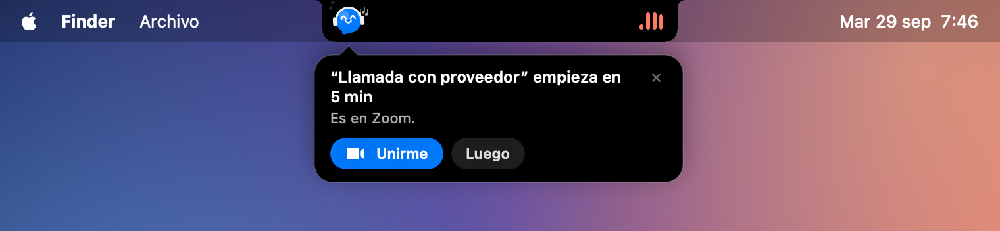

### 🗂️ Estante


- Tus **capturas de pantalla** y **descargas nuevas** llegan solas, con un aviso a los lados del notch.
- **Arrastra cualquier archivo al notch** para guardarlo y arrástralo después a donde quieras: correo, Slack, Finder…
- **AirDrop** en un toque: suelta el archivo del lado derecho del panel o usa el botón azul.
- Los archivos no se mueven ni se copian: el estante solo los enlaza.

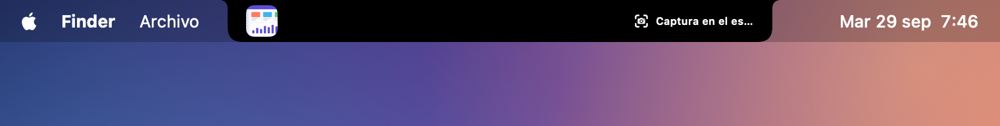

### 📋 Portapapeles con ranuras


- **⌘C + número (1–9)** guarda lo copiado en esa ranura. **⌘V + número** la pega, sin perder lo que tenías copiado.
- Las ranuras sobreviven a un reinicio. El historial (30 elementos) vive solo en memoria y omite lo que los gestores de contraseñas marcan como privado.

### 🤖 Claude Code desde el notch

Conecta UltraNotch con [Claude Code](https://claude.com/claude-code) y sigue tus sesiones sin cambiar de ventana.

<table>
  <tr>
    <td width="50%" align="center">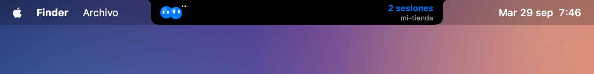<br><b>En vivo</b>: un personajito por sesión trabaja, piensa, te espera o festeja</td>
    <td width="50%" align="center"><br><b>Permisos</b>: Permitir · Siempre · Negar · Terminal</td>
  </tr>
  <tr>
    <td align="center">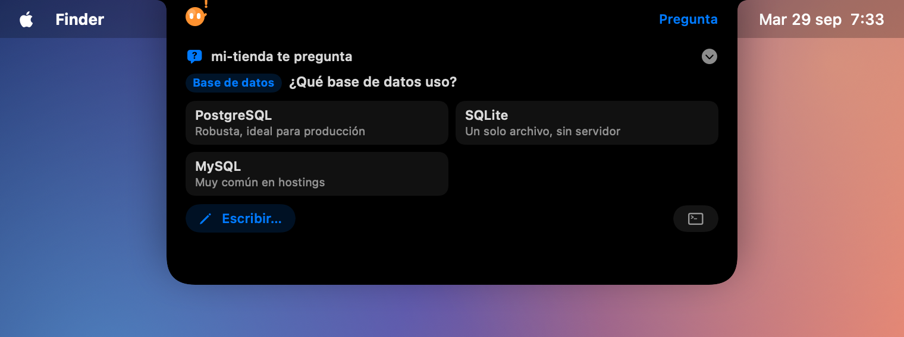<br><b>Preguntas</b>: elige una opción, varias o escribe la tuya</td>
    <td align="center">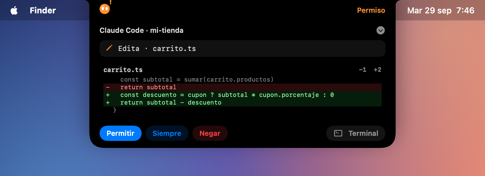<br><b>Vista previa</b>: qué renglones se quitan y cuáles se agregan</td>
  </tr>
</table>

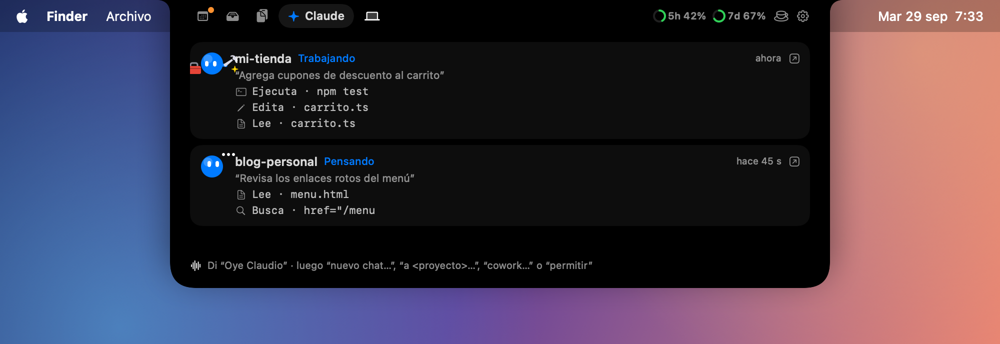

- **Pestaña Claude**: cada sesión con lo último que pediste, sus pasos recientes y el resumen al terminar.
- **Límites de uso**: dos anillos con tu sesión de 5 h y tu semana, y avisos al acercarte al tope.
- **Respóndele por voz** cuando una sesión termina: di *"responde…"* y tu mensaje le llega a esa misma sesión.
- **Sonidos por evento** y **cero ruido** de las sesiones automáticas (Agent SDK, plugins).
- Sin API ni costo extra: usa los *hooks* de Claude Code.

> [!IMPORTANT]
> **Para esto UltraNotch modifica `~/.claude/settings.json`.** Al tocar *Conectar con Claude Code* agrega unos *hooks* (SessionStart, UserPromptSubmit, PreToolUse, PermissionRequest, Notification, Stop, SessionEnd) que ejecutan `UltraNotch.app/Contents/MacOS/UltraNotch --claude-hook` y, si activas los límites de uso, se pone como `statusLine` (sigue mostrando la que ya tenías).
>
> - Antes de escribir guarda un respaldo: `settings.json.ultranotch-respaldo-<fecha>`. No toca tus otros ajustes ni tus hooks.
> - Los hooks hablan con la app por un socket local. **Si UltraNotch está cerrado, terminan al instante** y Claude Code sigue normal.
> - Aplica a sesiones nuevas de Claude Code.
> - **Para quitarlos:** Configuración › Claude › *Desconectar*, el menú de la barra › *Desconectar Claude Code*, o `./desinstalar.sh`.

### 💻 Tu Mac


CPU, memoria, disco, temperatura y batería en vivo; las apps que más RAM usan (con botón para cerrarlas); **Liberar RAM** y **Liberar espacio** (Papelera, cachés, descargas y capturas viejas, cachés de desarrollo), siempre con confirmación. Te avisa si el disco se llena, la RAM se agota o la Mac se calienta.

### 💙 Dottie

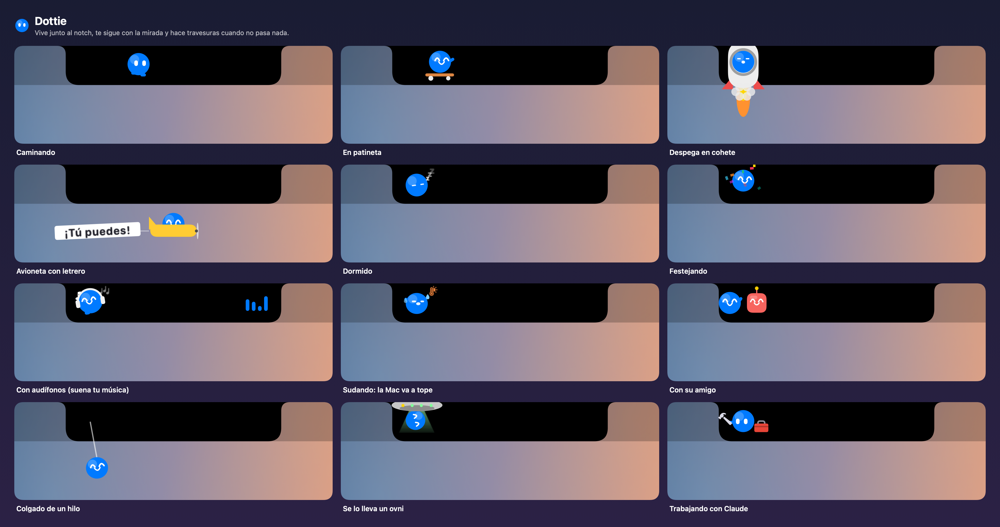

Dottie vive junto al notch y tiene **más de 30 animaciones**: camina, se cuelga de un hilo, anda en patineta, despega en cohete, viaja en ovni, pasa en avioneta con letrero y recibe a su amigo, el cuadradito con antena.

- **Reacciona a lo que pasa:** saca su caja de herramientas cuando Claude trabaja y festeja con confeti cuando termina; se pone audífonos con tu música; suda si la Mac va a tope; se duerme si no la usas.
- **Sale de paseo:** baja al Dock, anda por ahí y regresa en globo, ovni o cohete.
- **Te avisa cosas** en globitos: juntas, Claude, batería, archivos nuevos.
- Su color y su comportamiento se ajustan en Configuración › Dottie.

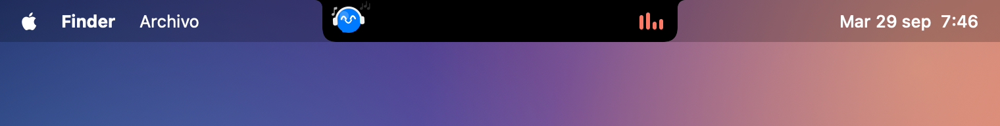

### 🎙️ Voz: "Oye Claudio"

Reconocimiento de voz **en tu Mac** (el audio no sale de tu computadora). Di la frase y luego la orden, o mantén **⌥ derecha** para hablar sin frase.

<details>
<summary><b>Ver todas las órdenes de voz</b></summary>

| Orden | Qué hace |
|---|---|
| **nuevo chat** + mensaje | Chat nuevo en Claude (app de Mac o navegador) |
| **a *proyecto*** + mensaje | Lo manda a uno de tus proyectos de Claude |
| **cowork** / **Claude Code** + mensaje | Tarea nueva de Cowork o sesión de Claude Code en Claude para Mac |
| **ChatGPT** + mensaje | Chat nuevo en ChatGPT (app o chatgpt.com) |
| **responde** + mensaje | Contesta a la sesión de Claude Code que acaba de terminar |
| **permitir** / **siempre** / **negar** | Responde el permiso pendiente |
| **terminal** + mensaje | Trae la terminal, escribe lo dictado y le da Enter |
| **estante**, **portapapeles**, **Mac**, **agenda** | Abre esa pestaña |
| **pausa**, **siguiente canción**, **canción anterior** | Controla la música |

- **Tu diccionario:** palabras que debe conocer y correcciones ("cloud code → Claude Code").
- **Limpieza del dictado:** quita muletillas y pone puntuación; con Apple Intelligence (macOS 26) queda todavía mejor, también en tu Mac.
- La frase se cambia en Configuración › Voz.

</details>

### ☕ Modo programación

Un botón y la Mac no se duerme, no apaga la pantalla ni se bloquea mientras trabajas. Dottie se queda despierta con su café.

---

## Requisitos

- **macOS 13 Ventura o superior.** Luce mejor en una Mac **con notch**; sin notch (o en un monitor externo) aparece una isla virtual arriba al centro.
- **Command Line Tools de Apple** para compilar: `xcode-select --install`.
- Algunas funciones piden algo más:
  - **Cristal líquido** y **limpieza del dictado con Apple Intelligence**: macOS 26 Tahoe con Apple Intelligence activada.
  - **"Oye Claudio"**: reconocimiento de voz en el dispositivo para tu idioma (Ajustes › Teclado › Dictado).
  - **Letra y controles**: Spotify o Música de Apple.
  - **Pestaña Claude**: Claude Code instalado; los límites de uso requieren plan Pro o Max.

<details>
<summary><b>¿Prefieres un .dmg? · ¿Venías de "Isla"?</b></summary>

- `./crear-dmg.sh` crea `UltraNotch-<versión>.dmg`. Como no está notarizado, la otra Mac pedirá *Ajustes › Privacidad y seguridad › Abrir de todos modos*.
- Con firma local, macOS olvida algunos permisos en cada reinstalación; el instalador los reinicia para que los vuelva a pedir limpio.
- **UltraNotch es el nuevo nombre de Isla.** `instalar.sh` quita `Isla.app`; la primera vez que abre, UltraNotch copia tus ajustes y datos, y reemplaza los hooks viejos de Claude Code sin duplicarlos.

</details>

## Permisos que pide

| Permiso | Para qué |
|---|---|
| **Accesibilidad** | Atajos ⌘C / ⌘V + número, tecla para hablar y escribir en la terminal |
| **Micrófono** y **Reconocimiento de voz** | "Oye Claudio" y el dictado (procesado en tu Mac) |
| **Calendarios** | Tus juntas en la pestaña Hoy |
| **Escritorio** y **Descargas** | Detectar capturas y descargas nuevas |
| **Automatización** (Terminal, iTerm2, Spotify, Música, Finder) | Ir a la sesión de Claude Code, controlar la música, vaciar la Papelera; solo cuando tú lo pides |
| Contraseña de administrador | Solo al usar *Liberar RAM* |

## Privacidad

**Se queda en tu Mac:** tu voz y el dictado, tu agenda, el portapapeles, el estante, tus sesiones de Claude Code y los registros. Los datos viven en `~/Library/Application Support/UltraNotch/`.

**Sale a internet** (solo esto, sin cuentas ni rastreo):

| Servicio | Qué se manda | Cuándo |
|---|---|---|
| [LRCLIB](https://lrclib.net) | Título, artista, álbum y duración de la canción | Al buscar la letra |
| Spotify oEmbed / búsqueda de iTunes | El enlace de la canción, o título y artista | Si la app de música no da la carátula |
| El link `.ics` que tú pongas | Una descarga del calendario | Solo si agregas un link |

Las órdenes de voz a Claude o ChatGPT abren esas apps (o su web) con tu mensaje; ahí aplican sus propias políticas.

## Desinstalar

```bash
./desinstalar.sh
```

Quita los hooks y la línea de estado de Claude Code (con respaldo de `settings.json`), la app, sus datos, sus ajustes y sus permisos. También limpia lo que haya quedado de Isla.

## Para desarrollar

<details>
<summary><b>Regenerar las capturas · Estructura del proyecto</b></summary>

Las imágenes de este README las dibuja la propia app con datos de ejemplo (no toca tus ajustes ni tus datos):

```bash
swift build -c release
.build/release/UltraNotch --capturas docs/capturas
```

```
UltraNotch/
├── Package.swift             Swift Package (se compila con `swift build`)
├── instalar.sh               Compila e instala en Aplicaciones
├── desinstalar.sh            Quita app, datos, permisos y hooks
├── crear-dmg.sh              Crea UltraNotch-<versión>.dmg
├── scripts/compilar.sh       Compila, arma UltraNotch.app y la firma
├── Resources/                Info.plist (nombre, permisos) e ícono
├── docs/                     Ícono y capturas del README
├── Sources/UltraNotchObjC/   Ayudante en Objective-C que atrapa NSException
└── Sources/UltraNotch/
    ├── UltraNotchApp.swift     Punto de entrada y modos sin interfaz (--claude-hook, --capturas…)
    ├── AppDelegate.swift       Arranque y menú de la barra
    ├── Migracion.swift         Copia ajustes y datos de Isla
    ├── Notch*.swift            Ventana sobre el notch, abrir/cerrar, avisos
    ├── IslandView.swift        El panel y sus pestañas
    ├── TodayView, NowPlaying, Lyrics, CalendarStore   Música, letra y agenda
    ├── Shelf*, FolderWatcher, AirDrop                 Estante
    ├── Clipboard*, KeyInterceptor                     Portapapeles y atajos
    ├── Claude*.swift           Hooks, sesiones, permisos, preguntas, límites
    ├── Companion*, BuddyFigure, StageExtras           Dottie
    ├── VoiceWake, HoldToTalk, PersonalDictionary      Voz y dictado
    ├── System*, MacView, KeepAwake                    Pestaña Mac y modo programación
    ├── Capturas.swift          Modo capturas
    └── SettingsView.swift      Configuración
```

</details>

## Licencia

[MIT](LICENSE) © 2026 Abraham Trujillo
